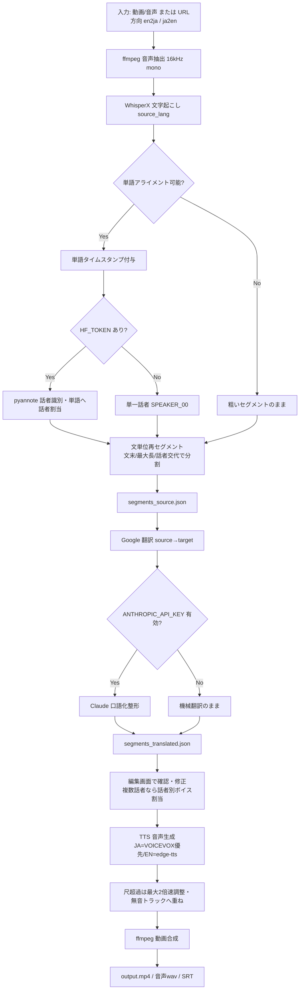

# 自動吹き替えシステム マスタードキュメント

> 本ドキュメントは、卒業研究の進捗報告・発表原稿・卒業論文・今後の開発・引き継ぎのための基礎資料である。
> 記載内容は、開発チャットで実際に行われた作業のみを根拠としている。チャット内に記載のない事項は「記載なし」と明記し、推測では記述していない。
>
> - 現行リポジトリ: `https://github.com/zenn24ct/autodubbing_pro_diarization`（public）
> - 現行ローカルパス（開発機）: `C:\dev\autodubbing_pro_diarization`
> - 開発機: MSI Katana 15 B13VGK（NVIDIA GPU 搭載 Windows 機）

---

## 0. 開発履歴（時系列）

### 0-1. 出発点：ベースシステム `autodubbing_en2ja_pro`

開発の起点は、既存の GitHub リポジトリ `zenn24ct/autodubbing_en2ja_pro` である。
これは「英語→日本語 自動吹き替え（VOICEVOX + Claude API 口語化整形）」という説明の付いた、
FastAPI ベースの小規模モノリス Web アプリだった。

当初のシステム構成（ベース版）：

- **バックエンド**: FastAPI（`app/main.py`）＋処理パイプライン（`app/pipeline.py`）
- **フロントエンド**: 素の HTML/CSS/JS 2 画面（`app/static/index.html` アップロード・進捗画面、`app/static/edit.html` 翻訳結果編集画面）
- **処理フロー（ベース版の 6 ステップ）**:
  1. ffmpeg で音声抽出 → openai-whisper で英語文字起こし → `segments_en.json`
  2. Google 翻訳（deep-translator）で日本語化
  3. Claude API（`claude-haiku-4-5`）で口語化・整形（API キーがある場合のみ）→ `segments_ja.json`
  4. VOICEVOX で日本語音声生成＋話速調整（最大 2 倍速）。VOICEVOX が使えなければ edge-tts にフォールバック
  5. ffmpeg で動画に日本語音声を合成 → `output.mp4`
  6. SRT 字幕ファイル生成 → `subtitle.srt`
- **セットアップ**: Ubuntu 前提の shell スクリプト（`setup.sh` / `setup_voicevox.sh` / `start_voicevox.sh` / `run.sh`）。apt / 7z / VOICEVOX linux-cpu 版バイナリを使用。

このベース版のセグメントデータ構造は `{start, end, text}` のみで、**話者情報を一切持たず**、
TTS の声も動画全体で 1 種類（`voice_key`）固定だった。

### 0-2. 第1段階：話者識別版 `autodubbing_en2ja_pro_diarization` の新規作成

**目的**：既存の自動吹き替えの流れ（Whisper・翻訳・Claude 整形・音声合成・動画生成）を壊さず再利用しつつ、
**WhisperX による話者識別（Speaker Diarization）** と、**話者交代時の音声切り替え** を追加すること。

**なぜ新リポジトリにしたか**：ユーザーの方針（新機能は既存リポジトリを直接改造せず新リポジトリで作る）に従い、
ベースを無改造のまま残し、新リポジトリ `autodubbing_en2ja_pro_diarization` を作成してそこに実装した。

要件として明示されたのは以下：
- 既存機能を維持する／全体を作り直さない／最小限の変更で実装する
- 話者 ID ごとに音声を切り替えられるようにする
- Windows 環境でも動作しやすい構成を意識する
- 将来リアルタイム翻訳へ拡張しやすい形にする

**この段階で加えた主な変更**：
- **文字起こしエンジンを openai-whisper から WhisperX へ置き換え**。理由：話者分離（pyannote.audio）と単語単位アライメントを同一パイプラインで扱うため。これに伴い各セグメントに `speaker` フィールドを付与。
- `merge_into_sentences`（文単位マージ）を拡張し、**話者が変わった箇所では文の途中でも必ず区切る**ようにした。理由：話者交代時に正しく音声を切り替える境界を保つため。
- `run_pipeline` に **話者 ID → 音声（voice_key）対応表 `speaker_voice_map`** を追加。`resolve_speaker_voice_map()` で、明示指定があればそれを使い、無ければデフォルト声のローテーション（`SPEAKER_VOICE_ROTATION = ["female","male","female2","male2"]`）を割り当てる。話者が 1 人なら従来どおり単一声（完全な後方互換）。
- WhisperX 用の設定を追加：`WHISPERX_DEVICE`（既定 cuda）、`WHISPERX_COMPUTE_TYPE`（cuda=float16 / cpu=int8）、`WHISPERX_BATCH_SIZE`（16）、`HF_TOKEN`（pyannote の gated モデル用）、`DIARIZATION_MIN_SPEAKERS` / `DIARIZATION_MAX_SPEAKERS`、`DEFAULT_SPEAKER = "SPEAKER_00"`。
- API 追加（`app/main.py`）：`GET /jobs/{job_id}/speakers`（検出話者一覧）、`POST /jobs/{job_id}/run` に `speaker_voice_map`（JSON 文字列）パラメータ追加。`Segment` モデルに `speaker`（任意）追加。
- UI（`app/static/edit.html`）：複数話者検出時のみ「話者別ボイス設定」パネルを表示し、話者ごとに声を選べるようにした。各行に話者バッジを表示。単一話者時はパネル非表示で従来 UI。
- **Windows 対応スクリプトを新規追加**：`setup.ps1` / `run.ps1` / `setup_voicevox.ps1` / `start_voicevox.ps1`（PowerShell）。既存 `.sh` は Ubuntu 用としてそのまま残置。理由：開発機が Ubuntu ではなく Windows（MSI Katana）だから。
- `requirements.txt`：`openai-whisper` を `whisperx` に置換。
- `.env.example`：`HF_TOKEN` ほか WhisperX 関連設定を追加。
- `.gitattributes`：`*.ps1 text eol=crlf` を追加（Windows で扱うため）。
- README を新規作成。
- GitHub に public リポジトリとして作成し push。

### 0-3. 第2段階：双方向化への一般化（リポジトリを `autodubbing_pro_diarization` にリネーム）

開発の途中、ユーザーから「日本語→英語と英語→日本語を別々に作るより、
**入力言語と出力言語を切り替えられる 1 つのシステムに共通化**した方が実装が簡単ではないか」という提案があった。

**判断**：これは「まったく新しい機能」ではなく「既存の EN→JA 専用パイプラインを双方向に一般化する改修」であるため、
新リポジトリを作らず、**既存リポジトリを大幅改修＋リネーム**する方針をユーザーと合意した。
リポジトリ名は `autodubbing_en2ja_pro_diarization` → **`autodubbing_pro_diarization`**（`en2ja` を外して双方向を表現）へ変更。

**この段階で加えた主な変更**：
- パイプラインを `source_lang` / `target_lang` でパラメータ化。WhisperX の言語指定、Google 翻訳の source/target、Claude 整形プロンプトを方向に応じて切り替え。
- **音声合成の非対称性への対応**：VOICEVOX は日本語専用のため、
  - JA 出力時：VOICEVOX 優先／失敗時 edge-tts（日本語ボイス）にフォールバック
  - EN 出力時：VOICEVOX は使えないため edge-tts の英語ボイスを直接使用（`EDGE_VOICES_EN`：Aria(US)/Guy(US)/Sonia(UK)/Ryan(UK)）
- ファイル名を汎用化：`segments_en` / `segments_ja` → `segments_source` / `segments_translated`。
- API 追加：`GET /jobs/{job_id}/direction`、`GET /jobs/{job_id}/segments_source`。`/upload`・`/download_url` に `direction`（`en2ja` / `ja2en`）パラメータ追加。
- UI：`index.html` に翻訳方向セレクタ（英語→日本語／日本語→英語）を追加し、方向に応じてボイス選択肢（VOICEVOX 話者 or 英語ボイス）を切り替え。`edit.html` の話者別ボイス設定も方向に応じたボイス一覧に対応。

### 0-4. 第3段階：Windows 実機（MSI Katana）での動作までのデバッグ

実機（MSI Katana、Windows、Python 3.13.5、CUDA ドライバ 12.9）でセットアップ・起動する過程で、
Windows 特有・環境特有の問題が多数発生し、都度修正した（詳細は「7. 開発中に解決した問題」）。
主なものは以下：

1. `.ps1` スクリプトの日本語が文字化けしパースエラー → **UTF-8 BOM 付与**で解決。
2. `setup_voicevox.ps1` のダウンロードがフリーズ → `-UseBasicParsing` と `$ProgressPreference = "SilentlyContinue"`。
3. VOICEVOX が `.vvpp` / `.vvppp` 分割パッケージで配布されていた → 分割ファイル結合＋ZIP 展開に対応。
4. アセット選定が複数形式（vvppp/7z/txt）を混同 → 拡張子で厳密フィルタ（優先順 vvpp/vvppp→zip→7z）。
5. 展開先が 1 階層深い場合 → 自動フラット化。
6. `setup.ps1` が pip 失敗を検知せず「完了」表示 → 終了コード確認（`Invoke-CheckedCommand`）。
7. `whisperx==3.3.1` が実在しない → `whisperx==3.8.6`。
8. PyTorch の CUDA インデックスが Python 3.13 非対応 → `cu121`→`cu124`→最終的に `torch==2.8.0` + `cu128`（whisperx/pyannote が torch~=2.8.0 を要求するため）。
9. CUDA 版 torch が requirements の CPU 版に上書きされる → インストール順序変更＋`--force-reinstall`。
10. Python 3.13 で `pydub` が `audioop` 欠落エラー → `audioop-lts==0.2.2` 追加。
11. `http://0.0.0.0:8000` にアクセスできない → `localhost` / `127.0.0.1` を案内（サーバー起動自体は成功していた）。

### 0-5. 第4段階：初回実行後に判明した実行時バグの修正

実機で初めて文字起こしが通った後、ログから複数の問題が判明し修正した：

1. **話者識別が毎回失敗**（`DiarizationPipeline.__init__() got an unexpected keyword argument 'use_auth_token'`）。whisperx 3.8.6／pyannote-audio 4.x で引数名が変わっていた → バージョン差を吸収する `_make_diarization_pipeline()` を追加（クラスの場所と `token`/`use_auth_token` を順に試す）。
2. **Claude API が 401（invalid x-api-key）**。`.env` の `ANTHROPIC_API_KEY` がプレースホルダのままだった → プレースホルダ検出時は整形をスキップしトレースバックを出さないガードを追加。
3. **UI の Whisper モデル選択が効かず常に large になる**。`.env` の `WHISPER_MODEL` が UI 選択を上書きしていた（設計上の env 優先）。→ コード変更ではなく、`.env` の該当行をコメントアウトすれば UI 選択が効く、と案内。
4. **音声エンジン選択が無視される**（edge-tts の Nanami を選んでも VOICEVOX のずんだもんになる）。JA 出力時は常に VOICEVOX 優先で、UI 上別々に見える声が内部で同一 voice_key に潰れていた → voice_key を `"engine:key"` 形式（`edge:female` / `voicevox:female`）にし、`tts_segment` がプレフィックスでエンジンを判定するよう変更。UI 側の選択肢もエンジン込みの値に更新。
5. **20 秒の動画でセグメントが 1 個しか出ない**。WhisperX は VAD ベースで長い区間を 1 セグメントとして返すが、`merge_into_sentences` は結合はできても分割ができなかった → 単語タイムスタンプを使って文末記号・最大長・話者交代で切り直す `_split_into_sentence_segments()` を追加し、アライメント成功時に使用。（単体ダミーデータでの分割動作は確認済み。実機での再検証はチャット内に記載なし。）

---

## 1. システム概要

### 1-1. システムの目的
動画（または音声）ファイルを入力すると、話している内容を自動で文字起こし・翻訳し、
翻訳先言語の音声で吹き替えた動画を自動生成する Web システム。英語↔日本語の双方向に対応する。

### 1-2. 解決したい課題
- 手作業での字幕付け・吹き替えは手間がかかる。これを文字起こし→翻訳→整形→音声合成→動画合成まで自動化する。
- 単純な機械翻訳の直訳は吹き替え音声として不自然。Claude API による口語化整形でこれを改善する。
- 従来は動画全体が 1 つの声だった。複数話者の動画で話者ごとに声を変えたい（話者識別＋話者別音声切り替え）。
- 英語→日本語と日本語→英語を別システムにすると二重管理になる。1 システムで方向を切り替えられるようにする。

### 1-3. 想定利用シーン
- 英語動画を日本語吹き替えにする／日本語動画を英語吹き替えにする。
- 複数人が登場する会話・インタビュー動画で、話者ごとに異なる声を割り当てる。
（※チャット内で明示された利用シーンはこの範囲。）

### 1-4. システム全体の流れ（概要）
アップロード（or URL）→ WhisperX 文字起こし（＋単語アライメント＋話者識別）→ 機械翻訳 → Claude 整形（任意）→
編集画面で確認・修正・話者別ボイス割り当て → TTS 音声生成 → 動画へ合成 → 完成物（動画・音声・SRT 字幕）ダウンロード。

### 1-5. システムの特徴
- 文字起こし→翻訳→整形→音声合成→動画合成を 1 本のパイプラインで自動化。
- WhisperX による**話者識別**と**話者交代時の音声自動切り替え**。
- **英語↔日本語の双方向**を 1 システムで切り替え。
- 出力言語に応じて TTS エンジンを切り替え（JA=VOICEVOX 優先、EN=edge-tts）。
- 翻訳結果を **Web 上で確認・編集**してから吹き替え生成できる。
- Windows / Ubuntu 両対応のセットアップスクリプト。
- 話者識別が使えない環境（HF_TOKEN 未設定）でも単一話者として動作するフォールバック設計。

### 1-6. 他システムとの違い（チャット内の範囲）
ベースの `autodubbing_en2ja_pro`（EN→JA 専用・話者情報なし・単一声）に対し、本システムは
「話者識別＋話者別音声切り替え」「双方向翻訳」「文単位再セグメント」を追加した発展版である。

---

## 2. システム構成

### 2-1. 全体構成
- **フロントエンド**：素の HTML/CSS/JavaScript（ビルド不要）。2 画面。サーバーから静的配信。
- **バックエンド**：FastAPI（ASGI サーバーは uvicorn）。バックグラウンドタスクで重い処理を実行し、ジョブ状態を JSON ファイルでポーリング管理。
- **外部プロセス/サービス**：ffmpeg（音声抽出・話速調整・動画合成）、VOICEVOX エンジン（ローカル HTTP サーバー :50021）、Google 翻訳（deep-translator 経由）、Claude API、edge-tts、yt-dlp。

### 2-2. ディレクトリ構成（現行）
```
autodubbing_pro_diarization/
├── app/
│   ├── __init__.py
│   ├── main.py            # FastAPI エンドポイント定義
│   ├── pipeline.py        # 文字起こし〜音声合成〜動画合成の処理本体
│   └── static/
│       ├── index.html     # アップロード・方向/モデル/声選択・進捗・DL 画面
│       └── edit.html      # 翻訳結果の確認・編集・話者別ボイス設定画面
├── requirements.txt       # Python 依存（torch は別途 CUDA 版を入れる）
├── .env.example           # 環境変数テンプレート
├── .gitattributes         # 改行コード指定（.ps1 は crlf）
├── .gitignore
├── README.md
├── MASTER_DOCUMENT.md     # 本ドキュメント
├── setup.sh / setup.ps1               # 環境セットアップ（Ubuntu / Windows）
├── setup_voicevox.sh / setup_voicevox.ps1  # VOICEVOX 導入（Ubuntu / Windows）
├── start_voicevox.sh / start_voicevox.ps1  # VOICEVOX 起動（Ubuntu / Windows）
└── run.sh / run.ps1                   # アプリ起動（Ubuntu / Windows）
```
実行時には `jobs/`（.gitignore 対象）が作られ、ジョブごとにアップロード元・中間 JSON・成果物が置かれる。

### 2-3. 各フォルダ・主要ファイルの役割
- `app/main.py`：HTTP API（アップロード、URL 取得、状態取得、セグメント取得/保存、話者一覧、方向取得、実行、成果物ダウンロード）。重い処理は `BackgroundTasks` に投げる。
- `app/pipeline.py`：中核。音声抽出、WhisperX 文字起こし＋単語アライメント＋話者分離、文単位再セグメント、機械翻訳、Claude 整形、TTS（VOICEVOX / edge-tts）、話速調整、無音トラックへの重ね合わせ、ffmpeg 動画合成、SRT 生成、話者→声の解決。
- `app/static/index.html`：入力（ファイル/URL）、翻訳方向、Whisper モデル、声の選択、進捗表示、成果物ダウンロード。
- `app/static/edit.html`：原文と翻訳文を並べて表示・編集、話者バッジ表示、複数話者時の話者別ボイス設定、吹き替え実行。
- `*.ps1` / `*.sh`：Windows / Ubuntu 用のセットアップ・起動スクリプト。

### 2-4. 主要 API エンドポイント（現行 `app/main.py`）
```
GET  /                              index.html 配信
GET  /edit                          edit.html 配信
POST /upload                        ファイルアップロード（model, direction）
POST /download_url                  URL から取得（yt-dlp）（model, direction）
GET  /jobs/{job_id}/status          ジョブ状態（JSON）
GET  /jobs/{job_id}/direction       翻訳方向（source_lang, target_lang）
GET  /jobs/{job_id}/segments        翻訳済みセグメント（編集済み優先）
GET  /jobs/{job_id}/segments_source 原文セグメント（参照用）
PUT  /jobs/{job_id}/segments        編集済みセグメント保存
GET  /jobs/{job_id}/speakers        検出話者 ID 一覧
POST /jobs/{job_id}/run             吹き替え実行（voice, subtitle, speaker_voice_map）
GET  /jobs/{job_id}/download        完成動画（output.mp4）
GET  /jobs/{job_id}/subtitle        SRT 字幕
GET  /jobs/{job_id}/audio           日本語/翻訳音声（japanese_audio.wav 相当）
```

---

## 3. 使用技術一覧

- **プログラミング言語**：Python（開発機では 3.13.5）、HTML / CSS / JavaScript、シェルスクリプト（bash）、PowerShell。
- **Web フレームワーク**：FastAPI、ASGI サーバー uvicorn。
- **音声認識・話者識別**：WhisperX（内部で faster-whisper 系＋単語アライメント＋pyannote.audio 話者分離）。
- **機械翻訳**：Google 翻訳（deep-translator 経由）。
- **文章整形（口語化）**：Claude API（Anthropic）。
- **音声合成（TTS）**：VOICEVOX（日本語・ローカルエンジン）、edge-tts（日本語・英語ボイス）。
- **動画・音声処理**：ffmpeg / ffprobe、pydub。
- **動画取得**：yt-dlp。
- **話者分離基盤**：pyannote.audio（Hugging Face の gated モデル）。
- **数値計算/DL 基盤**：PyTorch（torch / torchaudio）、numpy。
- **環境変数管理**：python-dotenv。
- **GPU**：NVIDIA CUDA（開発機ドライバ 12.9、PyTorch は cu128 ビルド）。
- **バージョン管理・ホスティング**：Git / GitHub（gh CLI）。

---

## 4. 使用モデル・ライブラリ・ツール一覧

> バージョンはチャット内に明記があるもののみ記載。明記がないものは「バージョン不明（チャット内に記載なし）」とする。

| 名称 | バージョン | 目的 | 採用理由（チャット内根拠） | 公式/参考 URL |
|---|---|---|---|---|
| Python | 3.13.5（開発機） | 実行環境 | 開発機に導入済み | https://www.python.org/ |
| FastAPI | 0.137.2 | Web API | ベース版から継続使用 | https://fastapi.tiangolo.com/ |
| uvicorn[standard] | 0.49.0 | ASGI サーバー | FastAPI 実行用 | https://www.uvicorn.org/ |
| python-multipart | 0.0.32 | ファイルアップロード処理 | フォーム/ファイル受信 | 記載なし |
| WhisperX | 3.8.6 | 文字起こし＋単語アライメント＋話者分離 | 話者識別を同一パイプラインで扱うため openai-whisper から置換 | https://github.com/m-bain/whisperX |
| edge-tts | 7.2.8 | TTS（日本語/英語ボイス、VOICEVOX 不可時/EN 出力） | 追加インストール不要・英語対応・API キー不要 | https://github.com/rany2/edge-tts |
| pydub | 0.25.1 | 音声セグメント操作・重ね合わせ | ベース版から継続 | https://github.com/jiaaro/pydub |
| audioop-lts | 0.2.2（python>=3.13） | pydub が依存する audioop の後方互換 | Python 3.13 で標準ライブラリ audioop が削除されたため | https://pypi.org/project/audioop-lts/ |
| deep-translator | 1.11.4 | Google 翻訳ラッパー | ベース版から継続 | https://github.com/nidhaloff/deep-translator |
| numpy | 2.4.6 | 数値計算 | 依存 | https://numpy.org/ |
| anthropic (SDK) | 0.109.2 | Claude API 呼び出し | 口語化整形 | https://docs.anthropic.com/ |
| yt-dlp | 2026.6.9 | URL からの動画取得 | URL 入力対応 | https://github.com/yt-dlp/yt-dlp |
| python-dotenv | 1.2.2 | .env 読み込み | 環境変数管理 | https://github.com/theskumar/python-dotenv |
| PyTorch (torch/torchaudio) | 2.8.0 + cu128 | DL 基盤（WhisperX/pyannote が要求） | whisperx 3.8.6 / pyannote-audio 4.0.7 が torch~=2.8.0 を要求、cu128 が Python3.13・CUDA12.9 と整合 | https://pytorch.org/ |
| torchvision | 0.23.0 | torch 依存（エラーログに出現） | 依存として存在（torch==2.8.0 要求） | https://pytorch.org/ |
| pyannote-audio | 4.0.7 | 話者分離モデル | WhisperX の diarization に使用 | https://github.com/pyannote/pyannote-audio |
| VOICEVOX ENGINE | 0.25.2（実機で検出された nvidia 版アセット名より） | 日本語 TTS | 高品質な日本語音声・話者バリエーション | https://voicevox.hiroshiba.jp/ |
| Claude モデル | `claude-haiku-4-5`（口語化整形に使用） | 口語化・整形 | 安価なモデルで十分と判断 | https://docs.anthropic.com/ |
| Whisper モデル | 既定 large-v3（UI 選択：tiny/base/small/medium/large-v3） | 文字起こしモデルサイズ | 高精度のため既定 large-v3 | 記載なし |
| ffmpeg / ffprobe | バージョン不明（チャット内に記載なし） | 音声抽出・話速調整・動画合成・長さ取得 | 標準的な動画処理 | https://ffmpeg.org/ |
| Google 翻訳 | バージョン不明（deep-translator 経由） | 機械翻訳 | ベース版から継続 | 記載なし |
| CUDA（ドライバ） | 12.9（開発機、nvidia-smi 表示） | GPU 実行 | 開発機の GPU ドライバ | https://developer.nvidia.com/cuda-toolkit |

> 参考：openai-whisper==20250625 はベース版 `requirements.txt` に存在したが、本システムでは WhisperX に置換済み（現行では不使用）。

### edge-tts ボイス割り当て（コード内定義）
- 日本語（`EDGE_VOICES_JA`）：female=`ja-JP-NanamiNeural`、male=`ja-JP-KeitaNeural`
- 英語（`EDGE_VOICES_EN`）：female=`en-US-AriaNeural`、male=`en-US-GuyNeural`、female2=`en-GB-SoniaNeural`、male2=`en-GB-RyanNeural`

### VOICEVOX 話者 ID（`VOICEVOX_SPEAKERS`、`.env` で変更可）
- female=3（ずんだもん）、male=11（玄野武宏）、female2=8（春日部つむぎ）、male2=9（雨晴はう）
  ※ UI 表示では male2 を「四国めたん」と表記している箇所がある。

---

## 5. システム処理の流れ

### 5-1. 各工程

| 工程 | 処理内容 | 使用ライブラリ/モデル |
|---|---|---|
| ① 入力 | ファイルアップロード or URL 取得。方向（en2ja/ja2en）と Whisper モデルを指定 | FastAPI / yt-dlp |
| ② 音声抽出 | 動画から 16kHz mono WAV を抽出 | ffmpeg |
| ③ 文字起こし | WhisperX で source_lang を転写 | WhisperX（faster-whisper 系） |
| ④ 単語アライメント | 単語単位のタイムスタンプを付与（言語対応時のみ） | WhisperX align モデル |
| ⑤ 話者識別 | pyannote で話者分離し、単語に話者を割り当て（HF_TOKEN がある時のみ） | WhisperX diarization / pyannote-audio |
| ⑥ 文単位再セグメント | 単語タイムスタンプで文末・最大長・話者交代により分割 → `segments_source.json` | 自作 `_split_into_sentence_segments` |
| ⑦ 機械翻訳 | source→target を翻訳 | deep-translator（Google 翻訳） |
| ⑧ 口語化整形（任意） | 翻訳文を吹き替え用に整形（最大 20 セグメントずつ、markdown 除去、失敗時は原文維持） | Claude API（claude-haiku-4-5） |
| ⑨ 編集 | 原文/訳文を並べて確認・修正、複数話者なら話者別ボイス割り当て | edit.html |
| ⑩ 音声合成 | セグメントごとに話者/選択に応じた声で TTS。尺超過は最大 2 倍速に調整。無音トラックに開始位置で重ねる | VOICEVOX / edge-tts、pydub、ffmpeg(atempo) |
| ⑪ 動画合成 | 元動画に合成音声を多重化（音声のみ入力ならそのまま音声出力） | ffmpeg |
| ⑫ 字幕生成 | SRT 字幕を出力 | 自作 `generate_srt` |
| ⑬ 完成物 | 動画（output.mp4）・音声（wav）・字幕（srt）をダウンロード | FastAPI |

TTS のエンジン選択ルール（`tts_segment`）：
- voice_key は `"engine:key"` 形式。`edge:...` は edge-tts を直接使用、`voicevox:...`/プレフィックス無しは VOICEVOX 優先（JA 時）。
- target が JA 以外（EN 等）は VOICEVOX を使わず edge-tts 英語ボイスを直接使用。

### 5-2. フローチャート（Mermaid）


---

## 6. 実装済み機能

以下はチャット内で実装が確認できる機能。

1. **ファイル/URL 入力**
   - 概要：動画・音声ファイルのアップロード、または URL（YouTube 等）からの取得。
   - 実装理由：手元ファイルと Web 動画の両対応。
   - 対応形式：`.mp4 / .mov / .mkv / .avi / .mp3 / .wav / .m4a`（mov も対応、とチャットで確認済み）。
   - 関連：`app/main.py`（/upload, /download_url）、`app/static/index.html`。

2. **翻訳方向の切り替え（EN⇄JA）**
   - 概要：英語→日本語 / 日本語→英語 を UI で選択。
   - 実装理由：双方向を 1 システムで扱うため。
   - 工夫：`source_lang`/`target_lang` をジョブに保存し、以降の処理・UI が方向に追従。
   - 関連：`/jobs/{id}/direction`、`index.html`、`pipeline.py`。

3. **WhisperX による文字起こし**
   - 概要：選択した Whisper モデルサイズで source_lang を文字起こし。
   - 工夫：`WHISPERX_DEVICE`/`COMPUTE_TYPE`/`BATCH_SIZE` を環境変数化。
   - 関連：`pipeline.py::run_transcription`。

4. **単語アライメント＋話者識別（Speaker Diarization）**
   - 概要：単語単位タイムスタンプを付与し、pyannote で話者を割り当てる。
   - 実装理由：話者交代の検出と話者別音声切り替えの基盤。
   - 工夫：バージョン差を吸収する `_make_diarization_pipeline`。HF_TOKEN 未設定/失敗時は単一話者にフォールバック。アライメント非対応言語では時間重なりベースの話者割当にフォールバック（`_assign_speaker_by_overlap`）。
   - 関連：`pipeline.py`。

5. **文単位の再セグメント**
   - 概要：WhisperX の粗い（VAD ベース）セグメントを、単語タイムスタンプで文末・最大長・話者交代により分割。
   - 実装理由：字幕・音声同期の粒度を細かくするため。
   - 工夫：文末記号は英語（. ! ? …）＋日本語（。！？）。単語情報が無いセグメントは分割せず維持。
   - 関連：`pipeline.py::_split_into_sentence_segments`。（単体テストで動作確認済み、実機再検証は記載なし）

6. **機械翻訳**
   - 概要：deep-translator（Google 翻訳）で source→target を翻訳。
   - 関連：`pipeline.py`。

7. **Claude API による口語化整形（任意）**
   - 概要：翻訳文を吹き替え用の自然な話し言葉に整形。
   - 工夫：最大 20 セグメントずつバッチ送信、markdown コードブロック除去、失敗時は原文維持、プレースホルダ API キーは自動スキップ。
   - 関連：`pipeline.py::refine_segments_claude` ほか。

8. **翻訳結果の Web 編集**
   - 概要：原文と訳文を並べて表示し、各行を編集・削除して保存。
   - 関連：`edit.html`、`/jobs/{id}/segments`(GET/PUT)、`/jobs/{id}/segments_source`。

9. **話者別ボイス設定＋話者交代時の音声切り替え**
   - 概要：複数話者検出時、話者ごとに声を割り当て、セグメントごとに声を切り替えて合成。
   - 工夫：単一話者時は従来通り単一声（後方互換）。デフォルトは声のローテーション割り当て。
   - 関連：`edit.html`、`/jobs/{id}/speakers`、`resolve_speaker_voice_map`、`run_pipeline`。

10. **TTS エンジン選択（VOICEVOX / edge-tts）**
    - 概要：voice_key の `engine:` プレフィックスでエンジンを明示選択。JA は VOICEVOX 優先/edge フォールバック、EN は edge-tts 英語ボイス。
    - 実装理由：ユーザーが選んだエンジン・声を確実に反映するため（旧実装では選択が無視されていた）。
    - 関連：`pipeline.py::tts_segment`、`index.html`、`edit.html`。

11. **話速調整（最大 2 倍速）**
    - 概要：TTS 音声がセグメント尺を超える場合、ffmpeg atempo で最大 2 倍まで加速。超える場合はそのまま。
    - 関連：`pipeline.py::adjust_speed` / `_build_atempo`。

12. **動画合成・音声/字幕出力**
    - 概要：無音トラックに各音声を開始位置で重ね、元動画に多重化して output.mp4 を生成。SRT 字幕も出力。音声のみ入力時は音声を出力。
    - 関連：`pipeline.py::run_pipeline` / `generate_srt`。

13. **進捗表示・ジョブ管理**
    - 概要：`status.json` に進捗を書き、フロントが 2 秒間隔でポーリング表示。
    - 関連：`update_status`、`/jobs/{id}/status`、`index.html`。

14. **Windows / Ubuntu 両対応のセットアップ**
    - 概要：PowerShell（.ps1）と bash（.sh）のセットアップ・起動・VOICEVOX 導入スクリプト。
    - 関連：`setup.ps1`/`run.ps1`/`setup_voicevox.ps1`/`start_voicevox.ps1` と対応する `.sh`。

---

## 7. 開発中に解決した問題

| # | 問題 | 原因 | 解決方法/修正内容 |
|---|---|---|---|
| 1 | `.ps1` 実行時に日本語が文字化けし `MissingEndCurlyBrace` 等のパースエラー | Windows PowerShell 5.1 が BOM 無し UTF-8 を Shift-JIS と誤読し、コメントが壊れて括弧対応が崩れる | 全 `.ps1` に UTF-8 BOM を付与 |
| 2 | `setup_voicevox.ps1` のダウンロードが「一生終わらない」 | `Invoke-WebRequest`/`Invoke-RestMethod` の既定進捗バー描画が極端に遅い＋IE 解析エンジン絡みで停止 | `-UseBasicParsing`、`$ProgressPreference="SilentlyContinue"`、完了検証を追加 |
| 3 | 「未対応の圧縮形式です: ...vvppp」 | VOICEVOX が `.vvpp`/`.vvppp`（拡張子違いの ZIP、分割配布）で配布されていたが単一 zip/7z しか想定していなかった | 分割ファイルを結合し ZIP として展開する処理を追加 |
| 4 | 6 ファイル全部を拾って壊れた ZIP を作る | 「windows」「nvidia」部分一致で vvppp/7z/txt を混同 | 拡張子で厳密フィルタし 1 形式のみ選択（優先 vvpp/vvppp→zip→7z） |
| 5 | 展開後 run.exe が見つからない | 展開物が 1 階層深いサブフォルダに入る | サブフォルダを再帰検索し中身を直下へ移動（自動フラット化）＋失敗時に中身一覧表示 |
| 6 | `setup.ps1` が pip 失敗を無視して「完了」表示、uvicorn 未インストール | `$ErrorActionPreference="Stop"` は外部 exe の非 0 終了を検知しない | 各 pip 後に終了コードを確認する `Invoke-CheckedCommand` を追加 |
| 7 | `No matching distribution found for whisperx==3.3.1` | whisperx 3.3.1 は PyPI に存在しない | `whisperx==3.8.6` に修正 |
| 8 | `No matching distribution found for torch`（cu121） | PyTorch 2.6 以降で Python 3.13 対応となり cu121 が廃止 | `cu124`→さらに whisperx/pyannote が torch~=2.8.0 要求のため `torch==2.8.0` + `cu128`（CUDA12.9 と下位互換） |
| 9 | `torch.cuda.is_available()` が False | requirements.txt 経由で CPU 版 torch が CUDA 版を上書き | requirements を先に入れ、最後に CUDA 版を `--force-reinstall`。CUDA 検証ステップ追加 |
| 10 | `ModuleNotFoundError: No module named 'pyaudioop'` | Python 3.13 で標準ライブラリ audioop が削除、pydub が読み込み失敗 | `audioop-lts==0.2.2`（python_version>=3.13）を追加 |
| 11 | `http://0.0.0.0:8000` に接続できない | 0.0.0.0 は全インターフェース待受表記でブラウザ用アドレスではない | `localhost` / `127.0.0.1` を使用（サーバー起動自体は成功） |
| 12 | 話者識別が毎回失敗（`unexpected keyword argument 'use_auth_token'`） | whisperx 3.8.6/pyannote 4.x で引数名が `token` に変化 | クラス位置と `token`/`use_auth_token` を順に試す `_make_diarization_pipeline` |
| 13 | Claude 401（invalid x-api-key） | `.env` の API キーがプレースホルダのまま | プレースホルダ検出時は整形をスキップしトレースバックを抑制 |
| 14 | Whisper モデルを選んでも常に large | `.env` の `WHISPER_MODEL` が UI 選択を上書き（env 優先設計） | コード変更ではなく `.env` の該当行コメントアウトで UI 選択有効化（案内） |
| 15 | edge-tts の Nanami を選んでも VOICEVOX ずんだもんになる | JA 出力時は常に VOICEVOX 優先、UI 上の別声が同一 voice_key に潰れていた | voice_key を `engine:key` 形式にし `tts_segment` がエンジン判定。UI 選択肢も更新 |
| 16 | 20 秒動画でセグメントが 1 個 | WhisperX は VAD ベースで長区間を 1 セグメントで返し、`merge_into_sentences` は分割できない | 単語タイムスタンプで文単位に分割する `_split_into_sentence_segments` を追加 |

---

## 8. 現在できること

チャット内の実装状況として、現在できること：
- 英語→日本語 の自動吹き替え（UI から実行可能）。
- 日本語→英語 の自動吹き替え（方向切り替え・EN 出力は edge-tts）。**実装済み**だが、ja2en の実機通し確認はチャット内に記載なし。
- 1 つのシステムでの双方向切り替え（UI の方向セレクタ）。
- WhisperX による文字起こし（GPU 想定、モデルサイズ選択可）。
- 話者識別と話者別音声切り替え（**実装済み**。実機での複数話者の最終動作確認はチャット内に記載なし。初回実行時は use_auth_token バグで失敗しており、その後修正した）。
- 文単位の再セグメント（**実装済み・単体テスト確認済み**。実機再検証は記載なし）。
- 翻訳結果の Web 編集。
- Claude API による口語化整形（有効な API キーを入れれば動作。コード修正なしで後から有効化可能）。
- VOICEVOX / edge-tts のエンジン・声の選択。
- 動画・音声・SRT 字幕の生成とダウンロード。
- GUI（ブラウザ）操作。
- Windows（MSI Katana、Python 3.13、torch 2.8.0+cu128）での起動（`Application startup complete` まで確認済み）。

**実機で確認できた範囲（チャット内）**：文字起こし→翻訳→整形ステップまでは 1 本の動画で通り、`ready_to_edit`/編集画面まで到達。完成動画（output.mp4）の生成成功可否そのものはチャット内に明示記載なし。

---

## 9. 現在残っている課題

- **話者識別・話者交代対応・複数話者対応**：機能としては**実装済み**。ただし複数話者の実動画での最終動作確認はチャット内に記載なし（初回はバグで失敗→修正済みのため、修正後の実機再検証が必要）。
- **文単位再セグメントの実機検証**：単体ダミーデータでは確認済みだが、実機の実動画での再検証が必要。
- **日本語→英語方向の実機検証**：実装済みだが実機通し確認は記載なし。
- **日本語入力時のアライメント**：日本語のアライメントモデルが読めない場合は粗いセグメントにフォールバックする設計。日本語入力で 1 セグメントのままになる可能性があり、その場合の追加対応は未実施（要ログ確認と設計上ペンディング）。
- **CUDA 有効性の最終確認**：`torch==2.8.0+cu128` 導入後の `torch.cuda.is_available()` の最終結果はチャット内に明示記載なし（導入手順は実施済み）。
- **リアルタイム翻訳**：未実装。将来拡張の前提として、`speaker_voice_map`・`source_lang`/`target_lang` を API パラメータとして疎結合化し、話者情報を JSON で永続化する設計にしてある（差し替えやすい土台のみ用意済み）。

---

## 10. 今後の開発予定

チャット内で言及された今後の方向性：
- リアルタイム翻訳への拡張（バッチ処理前提を崩さずセグメント単位ストリーム処理へ差し替えやすい設計にしてある）。
- 複数話者・話者交代の実機検証と精度確認。
- 日本語入力時のセグメント分割・アライメント対応の改善。
- （運用）Claude API キーの投入による口語化整形の有効化。

> 上記以外の具体的な新機能計画はチャット内に記載なし。

---

## 11. 進捗報告用まとめ

- **今回何を実装したか**：
  - ベースの「英語→日本語・単一声」自動吹き替えを、**WhisperX による話者識別**と**話者交代時の音声自動切り替え**に対応させた。
  - さらに **英語↔日本語の双方向**を 1 システムで切り替えられるよう一般化した。
  - WhisperX の粗いセグメントを**文単位に再分割**する処理を追加し、字幕・音声同期の粒度を改善。
  - **Windows（MSI Katana）実機**で動作するよう、PowerShell セットアップ一式を整備し、多数の環境依存問題を解決。
- **以前から何が改善されたか**：
  - 文字起こしエンジンを openai-whisper → WhisperX に刷新（話者情報を扱えるように）。
  - TTS が「動画全体で 1 声」から「話者ごと・セグメントごとに声を切り替え」に進化。
  - 出力言語に応じて TTS エンジンを自動切り替え（JA=VOICEVOX、EN=edge-tts）。
  - UI が「単一声選択」から「方向選択＋話者別ボイス設定」に拡張。
- **システム全体がどう進化したか**：
  EN→JA 専用の単方向・単一声システムから、**双方向・話者識別対応・話者別多声**の吹き替えシステムへ発展。
  さらに将来のリアルタイム翻訳を見据えた疎結合設計を導入した。

---

## 12. 発表原稿作成用まとめ

- **強調すべき点**：
  - 既存の動作するシステムを壊さずに、話者識別と双方向翻訳という大きな機能を段階的に統合した「拡張」開発である点。
  - 話者交代を検出し、話者ごとに声を自動で切り替える吹き替えを実現した点。
- **アピールポイント**：
  - 文字起こし・翻訳・整形・音声合成・動画合成を 1 本のパイプラインで自動化。
  - 出力言語で TTS エンジンを切り替える非対称設計（JA=VOICEVOX、EN=edge-tts）を、UI の声選択と一貫させた。
  - WhisperX の粗いセグメントを単語タイムスタンプで文単位に切り直し、同期精度を確保。
- **工夫した点**：
  - HF_TOKEN 未設定や API キー未設定でも壊れず単一話者/整形スキップにフォールバックする堅牢設計。
  - ライブラリ/OS 依存の多数の落とし穴（BOM、CUDA バージョン、audioop 削除、VOICEVOX 分割配布 等）を一つずつ解決し、Windows 実機で起動まで到達。
  - voice_key に `engine:key` 形式を導入し、UI の選択が確実に反映されるようにした。
- **研究としての新規性（チャット内の範囲での主張）**：
  - 「話者識別＋話者別音声切り替え」と「双方向翻訳」を同一の吹き替えパイプライン上で統合し、
    さらにリアルタイム翻訳への拡張を見据えた疎結合設計を採った点。

---

## 13. 引き継ぎ情報

### 13-1. 設計思想
- **既存を壊さない拡張**：ベースのパイプライン構造（文字起こし→翻訳→整形→TTS→動画合成）を保ったまま機能を足す。
- **フォールバック優先**：話者識別（HF_TOKEN）や整形（Claude キー）やアライメントが使えなくても、単一話者・整形なし・粗いセグメントで最後まで動く。
- **疎結合・将来拡張**：`source_lang`/`target_lang`・`speaker_voice_map` を API パラメータ化し、話者情報を JSON で永続化。将来のリアルタイム化で差し替えやすく。
- **非対称な TTS を UI と一致させる**：VOICEVOX は日本語専用のため、出力言語でエンジンを分け、voice_key にエンジンを明示する。

### 13-2. コーディング方針
- 変更は最小限・局所的に。周囲のコードのスタイル（日本語コメント、区切りコメント `── ... ──`）に合わせる。
- 後方互換を保つ（プレフィックス無し voice_key は従来動作、単一話者は従来 UI）。
- 例外は握りつぶさず、失敗時はログとフォールバックを明示。

### 13-3. 注意事項（重要）
- **`.ps1` は UTF-8 BOM 付き**で保存する（BOM が無いと Windows PowerShell 5.1 で文字化け・パースエラー）。
- **PyTorch は requirements の後に CUDA 版を `--force-reinstall`**（順序を守らないと CPU 版に上書きされる）。開発機は `torch==2.8.0` + `cu128`（whisperx/pyannote が torch~=2.8.0 要求、CUDA ドライバ 12.9）。
- **Python 3.13 では `audioop-lts` が必須**（pydub 依存）。
- **`.env` を変更したら `run.ps1` を再起動**（環境変数は起動時読み込み。`--reload` はコード変更のみ反映）。
- **`WHISPER_MODEL` を `.env` に設定していると UI のモデル選択が上書きされる**。UI から選ばせたい場合は該当行をコメントアウト。
- **VOICEVOX は起動しておく**（別ターミナルで `start_voicevox.ps1`）。使わない/落ちている場合は edge-tts にフォールバック（ただし edge の日本語声は Nanami/Keita の 2 種のみ）。
- **HF_TOKEN は pyannote の gated モデル 2 つ（speaker-diarization-3.1 と segmentation-3.0）への同意**が必要。同意漏れだと話者識別が失敗し単一話者になる。
- **ブラウザは `localhost:8000`**（`0.0.0.0` では開けない）。HTML 変更後はハードリロード（Ctrl+F5）。

### 13-4. 今後変更しない前提（チャット内で確立した方針）
- ベースの処理段階の並び（文字起こし→翻訳→整形→TTS→動画合成）。
- フォールバック設計（HF_TOKEN/API キー/アライメント不在でも動く）。
- 話者情報を JSON で永続化する構造、`source_lang`/`target_lang`・`speaker_voice_map` のパラメータ化。
- voice_key の `engine:key` 形式。

### 13-5. 今後変更・検証予定の部分
- 複数話者・話者交代・文単位再セグメント・ja2en の**実機検証**。
- 日本語入力時のアライメント/分割改善。
- CUDA 有効性の最終確認。
- リアルタイム翻訳への拡張。

### 13-6. 開発時の注意点
- 実機は Windows（MSI Katana、Python 3.13.5、CUDA ドライバ 12.9）。Ubuntu 用 `.sh` は残置しているが、実際の検証は Windows 側で進行。
- ライブラリのバージョン整合（torch/whisperx/pyannote/torchvision がいずれも torch 2.8 系で揃うこと）に注意。
- モデル（large-v3 本体 約 3.09GB、align モデル 約 360MB 等）は**初回実行時に自動ダウンロード**される（事前インストール式ではない）。2 回目以降はキャッシュ利用。

---

### 付録：バージョン・環境の確定情報（チャット内根拠）
- 開発機：MSI Katana 15 B13VGK（NVIDIA GPU、Windows）
- Python：3.13.5
- CUDA ドライバ：12.9
- PyTorch：2.8.0 + cu128（導入手順実施。最終 `cuda.is_available()` 結果はチャット内に明示記載なし）
- whisperx：3.8.6 / pyannote-audio：4.0.7 / torchvision：0.23.0（エラーログより）
- audioop-lts：0.2.2 / edge-tts：7.2.8 / fastapi：0.137.2 / uvicorn：0.49.0
- VOICEVOX ENGINE：0.25.2（実機で検出された nvidia 版アセット名より）
- リポジトリ：`github.com/zenn24ct/autodubbing_pro_diarization`（public、旧名 `autodubbing_en2ja_pro_diarization`、さらに旧ベース `autodubbing_en2ja_pro`）
- ローカルパス：`C:\dev\autodubbing_pro_diarization`
